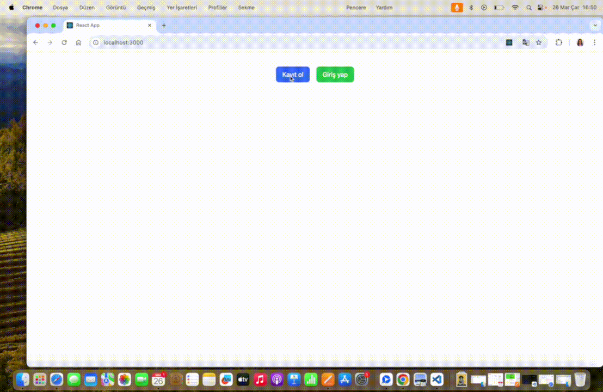

# 📋 ToDo List React Firebase Project

<li>This project helps users to keep track of their todo list.</li>
<li>It is built with modern web technologies and includes functions such as updating profile.</li>

## 🚀 Features

📩 SignUp : Users can quickly register for an account and login.

✅ Todo List: Users can add and delete things to do. They can view the list of todos.

👤 Profile Update: Users can update their name and profile picture. They can change the password.

📱 Responsive Design: With a mobile compatible and stylish design, it can be used easily on any device.

###  Technologies Used

<li>React</li>
<li>React-Redux</li>
<li>Firebase</li>
<li>React-router-dom</li>
<li>React-hot-toast</li>
<li>@formkit/auto-animate/react</li>
<li>@headlessui/react</li>
<li>Tailwind Css</li>

### 🌐 `Deploy`

### 🎥 `Screen`

# Todo-List-React-Redux-Project
